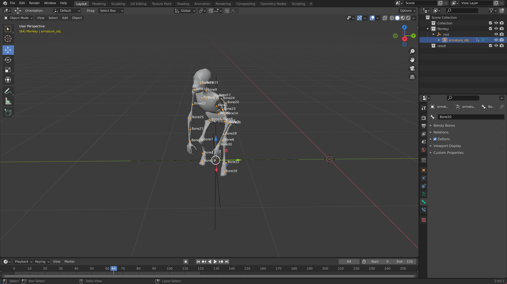
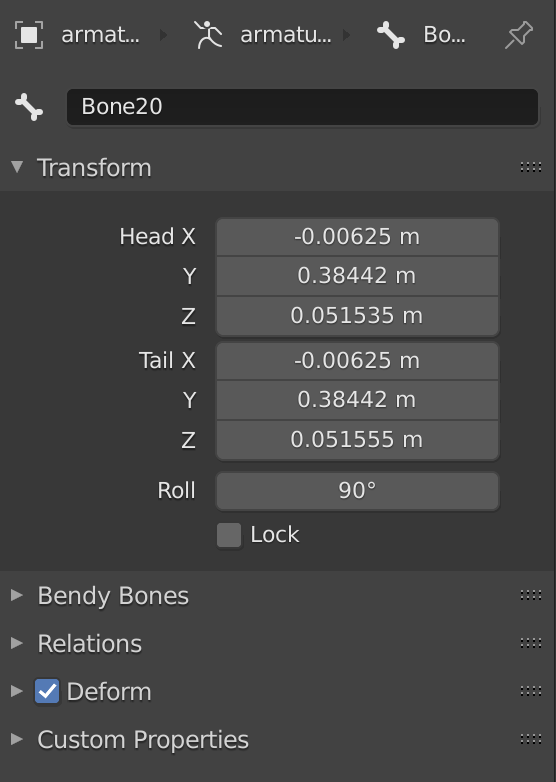

# Blender AN export

[Русская версия Readme](https://github.com/storm-devs/storm-engine/blob/develop/tools/blender-an-export/README_RUS.md)

## Requirements

In order to use this plugin you need:

- [NodeJs](https://nodejs.org/en/)

## Export .an.json from Blender
Select an object with armature



```
File -> Export... -> JSON AN Export(.an.json)
```

Exported animation works correctly only if bone is very small (tends to small point)

X and Y coordinates must be the same, Z differ by 0.00001.
Also Roll should be 90°



## Converting to .an
For correct work in game .an.json file from Blender should be converted to .an.
In order to do this you need to launch console (terminal) in the folder with ``parse-an-json.js`` script and run
``node parse-an-json.js {filepath}``

E.g.:
``node parse-an-json.js "C:\animations\man.an.json"``

The results (``man.an``) will be saved in the folder with .an.json file

### Remark about Windows
There is an easier way for Windows users -
you can drag file with parsed animation (.an.json) to the file ``parse-an-json.cmd`` and results will be saved in animation folder

## Blender Plugin Installation
```
Edit -> Preferences... -> Add-ons -> Install... -> Select export_json_an.py from io_export_json_an folder -> Enable "Export: JSON AN"
```

## Blender Usage
```
File -> Export... -> JSON AN Export(.an.json)
```

## Author

[Artess999](https://github.com/Artess999)

